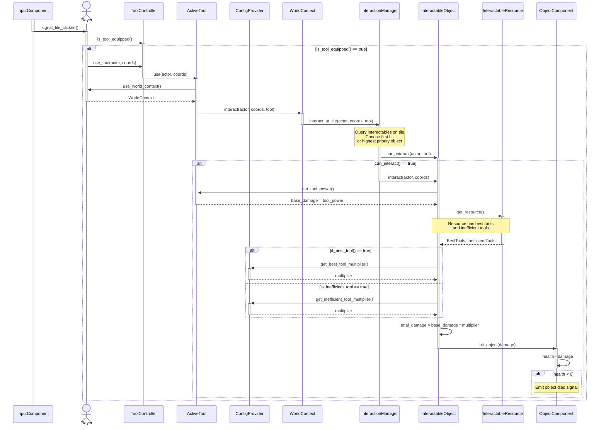

# Interaction system

An example of hitting a tree with an axe.

```mermaid
sequenceDiagram
        participant IC as InputComponent
        actor P as Player
        participant TC as ToolController
        participant T as ActiveTool
        participant CP as ConfigProvider
        participant WC as WorldContext
        participant IM as InteractionManager
        participant WC as WorldContext
        participant IM as InteractionManager
        participant O as InteractableObject
        participant R as InteractableResource
        participant OC as ObjectComponent

        activate IC
        IC->>-P: signal_tile_clicked()
        activate P
        P->>+TC: is_tool_equipped()
        alt is_tool_equipped() == true
            P->>TC: use_tool(actor, coords)
            TC->>-T: use(actor, coords)
            activate T
            T->>P: use_world_context()
            P-->>-T: WorldContext
            T->>+WC: interact(actor, coords, tool)
            WC->>-IM: interact_at_tile(actor, coords, tool)
            activate IM
            Note over IM: Query interactables on tile<br>Choose first hit<br>or highest priority object
            IM->>+O: can_interact(actor, tool)
            alt can_interact() == true
                IM->>-O: interact(actor, coords)
                O->>T: get_tool_power()
                T-->>-O: base_damage = tool_power
                O->>+R: get_resource()
                Note over O,R: Resource has best tools<br>and inefficient tools
                R-->>-O: BestTools, InefficientTools
                alt if_best_tool() == true
                    O->>+CP: get_best_tool_multiplier()
                    CP-->>-O: multiplier
                else is_inefficient_tool == true
                    O->>+CP: get_inefficient_tool_multiplier()
                    CP-->>-O: multiplier
                end
                O->>O: total_damage = base_damage * multiplier
                O->>-OC: hit_object(damage)
                activate OC
                OC->>-OC: health - damage
                alt health < 0
                    Note over OC: Emit object died signal
                end
            end
        end
```